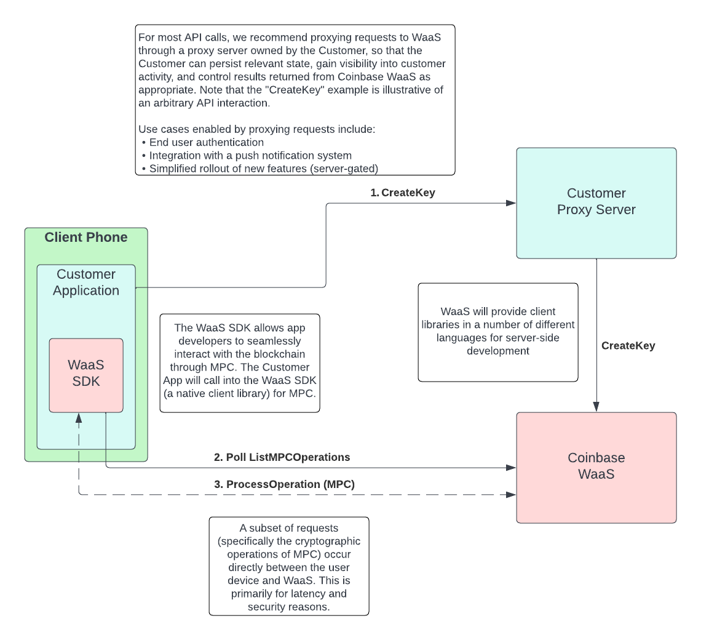

# React Native WaaS SDK

This is the repository for the mobile React Native SDK for Wallet-as-a-Service APIs. 
It exposes a subset of the WaaS APIs to the mobile developer and, in particular, is
required for the completion of MPC operations such as Seed generation and Transaction signing.

Currently, it only supports iOS.

### Prerequisites:

- [Xcode 14.0+](https://developer.apple.com/xcode/)
  - iOS15.2+ simulator (iPhone 14 recommended)
- [CocoaPods](https://guides.cocoapods.org/using/getting-started.html)
- [node 17+](https://nodejs.org/en/download/)
- [yarn 1.22+](https://yarnpkg.com/getting-started/install)

## Installation

1. [Create a personal access token (classic)](https://docs.github.com/en/authentication/keeping-your-account-and-data-secure/creating-a-personal-access-token#creating-a-personal-access-token-classic) with `read:packages:` set.
2. [Authenticate with your personal access token (classic).](https://docs.github.com/en/packages/working-with-a-github-packages-registry/working-with-the-npm-registry#authenticating-to-github-packages)
3. [Install the package in your React Native project](https://docs.github.com/en/packages/working-with-a-github-packages-registry/working-with-the-npm-registry#installing-a-package)

With `npm`:

```
npm install --save @cbhq/waas-sdk-react-native
```

With `yarn`:

```
yarn add @cbhq/waas-sdk-react-native
```

## Usage

See [index.tsx](./src/index.tsx) for the list of supported APIs.

## Example App

This repository provides an example app that demonstrates how the APIs should be used. To run it,
ensure you have XCode open and run the following from the root directory of the repository:

```bash
yarn install # Install packages for the root directory
yarn bootstrap # Install packages for the /example directory
yarn example ios --simulator "iPhone 14" # Build and start the app on iOS simulator
```

> NOTE: An example Cloud API Key json file is at `example/src/.coinbase_cloud_api_key.json`
> To run the example app, populate, or replace, this file with the Cloud API Key file provided to you
> by Coinbase.

## Recommended Architecture

Broadly speaking, there are two possible approaches to using the WaaS SDK:

1. Use the WaaS backends directly for all calls.
2. Use the WaaS backends directly only for MPC operations; proxy all other calls through an intermediate server.

Of these two approaches, we recommend approach #2, as outlined in the following diagram:



The motivation for placing a proxy server in between your application and the WaaS backends are as 
follows:

1. Your proxy server can log API calls and collect metrics.
2. Your proxy server can filter results as it sees fit (e.g. policy enforcement).
3. Your proxy server can perform end user authentication.
4. Your proxy server can store the Coinbase API Key / Secret, rather than it being exposed to the client.
5. Your proxy server can throttle traffic.

In short, having a proxy server that you control in between your application and the WaaS backends will
afford you significantly more control than using the WaaS backends directly in most cases.

The only APIs that _require_ direct-to-WaaS calls are:
- ListMPCOperations and its wrappers (pollForPendingSeeds, pollForPendingSignatures)
- processPendingSeed, processPendingSignature

Note that, while the [WaaS SDK example app](./example) asks for an API Key and Secret natively, this is not necessarily the recommended architecture.

